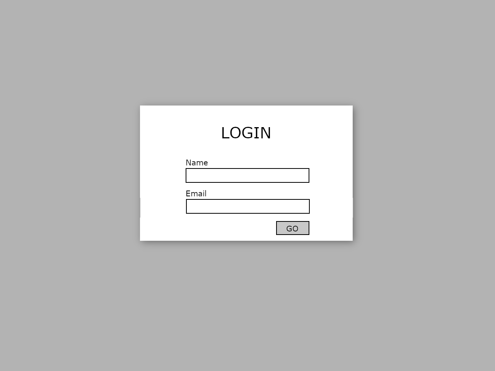
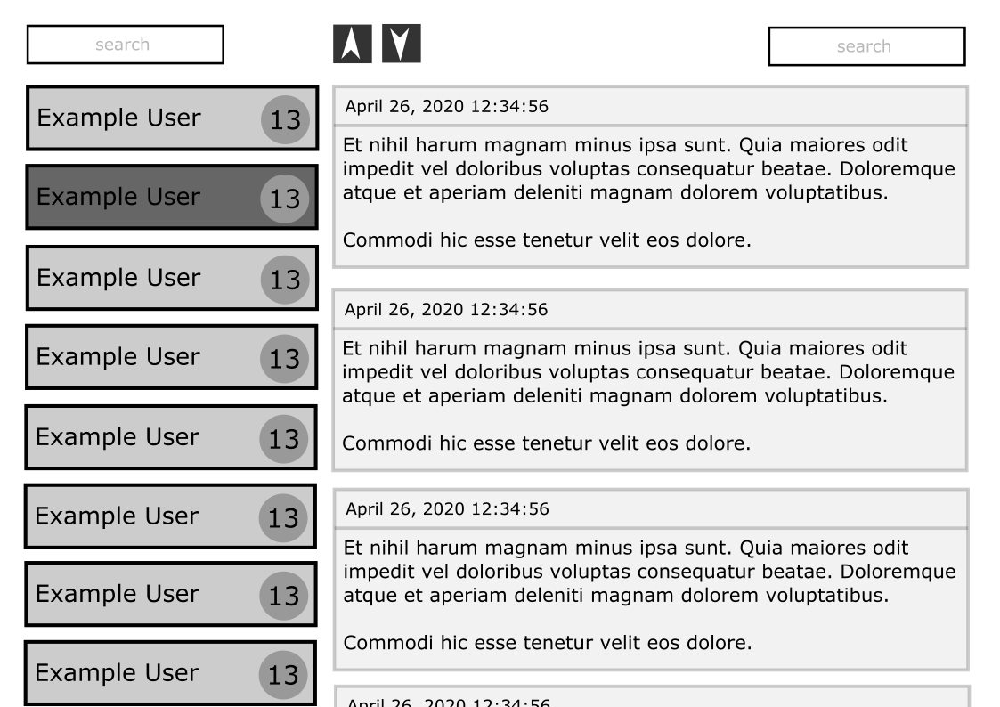

# Supermetrics Front-end Assignment

Welcome to Supermetrics Front-end coding assignment! We're happy to see you here. 

The purpose of this assignment is to help evaluate your React and front-end development skills. We use this assignment 
to determine the level of your coding and where you might fit in our developer stack. There is no wrong answer or wrong 
way of doing this. Please try to do this by yourself. This task may take up to between 3-5 hours and should preferably 
be done in Typescript but Javascript is also okay. The final submission should meet production quality standards.

## Task

- Create a simple post reader as a React SPA.
- Implement above using React components and CSS3.
- Retrieve the data shown in the app from the API described below.
- Concentrate on functionality, code quality and testability, not appearance.
- Any common state management, routing and/or testing library can be used.
- Using CSS toolkits and UI frameworks (bootstrap etc) is not ok. The purpose is to evaluate your coding skills, not npm skills.

Must haves:
- Login Screen with email and name inputs.
- Sender list with sender name and post count ordered by name alphabetically. 
- Clicking on a sender opens that sender's posts in the post list view.
- Post list where posts are ordered by creation time.
- Post order buttons to allow choosing most recent first and most recent last ordering for posts list

Nice to haves:
- Search box for senders. Any senders whose name do not contain the text entered are hidden
- Search box for posts. Any posts that do not contain the text entered are hidden
- Deep-linkable post list. This means that it is possible to enter a URL that directly selects the sender whose posts are shown.

## Rough Design



## API

1. Use the following endpoint to register a token:

    **POST:** `https://api.supermetrics.com/assignment/register`

    **PARAMS:**
   
    ```
    *client_id:* ju16a6m81mhid5ue1z3v2g0uh
 
    *email:* User's email from login screen
 
    *name:* User's name from login screen
    ```

    **RETURNS**
    
    ```
    *sl_token:* This token string should be used in the subsequent query. Please note that this token will only last 
                1 hour from when the REGISTER call happens. You will need to register and fetch a new token as you need it.
 
    *client_id:* Returned for informational purposes only
 
    *email:* Returned for informational purposes only
    ```

2. Use the following endpoint to fetch posts:

    **GET:** `https://api.supermetrics.com/assignment/posts`

    **PARAMS:**
    
    ```
    *sl_token:* Token from the register call
 
    *page:* Integer page number of posts (1-10)
    ```

    **RETURNS:**
    
    ```
    *page:* What page was requested or retrieved
 
    *posts:* 100 posts per page
    ```
   
Author: [Supermetrics](https://supermetrics.com)
